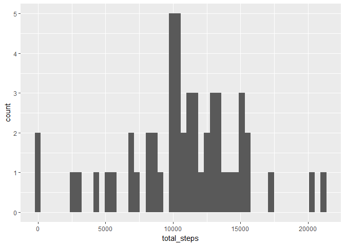
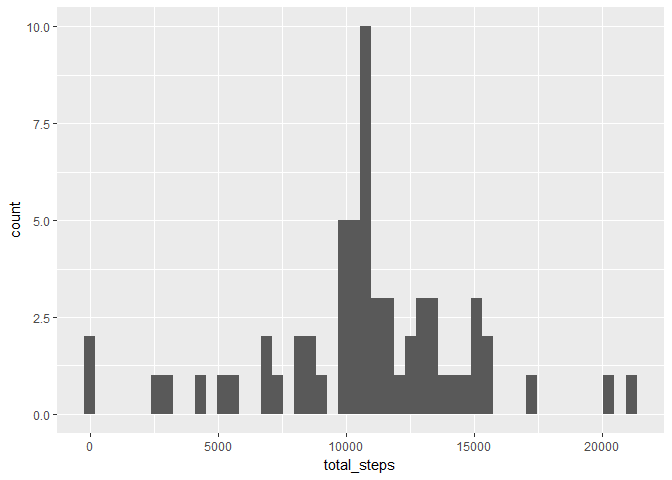
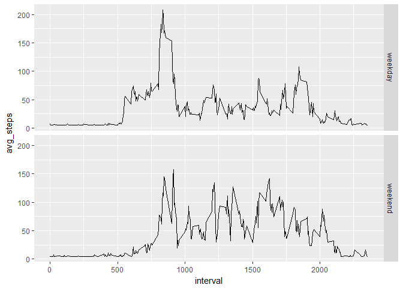

```r
library(ggplot2)
library(dplyr)
```

```
## 
## Attaching package: 'dplyr'
```

```
## The following objects are masked from 'package:stats':
## 
##     filter, lag
```

```
## The following objects are masked from 'package:base':
## 
##     intersect, setdiff, setequal, union
```


## Loading and preprocessing the data

### Load the data

```r
data <- read.csv(file="activity/activity.csv", header=TRUE, sep=",")
```

### Process/transform the data (if necessary) into a format suitable for analysis.

## What is mean total number of steps taken per day?

### Calculate the total number of steps taken per day.

```r
steps_per_day <- summarize(group_by(data, date), total_steps = sum(steps))
```

### Make a histogram of the total number of steps taken each day

```r
ggplot(steps_per_day, aes(x=total_steps)) + geom_histogram(bins=50)
```

```
## Warning: Removed 8 rows containing non-finite values (stat_bin).
```

<!-- -->

### Calculate and report the mean and median of the total number of steps taken per day

```r
mean(steps_per_day$total_steps, na.rm=TRUE)
```

```
## [1] 10766.19
```

```r
median(steps_per_day$total_steps, na.rm=TRUE)
```

```
## [1] 10765
```


## What is the average daily activity pattern?

### Make a time series plot of the 5-minute interval (x-axis) and the average number of steps taken, averaged across all days (y-axis).

```r
steps_per_interval <- summarize(group_by(data, interval), avg_steps = mean(steps, na.rm=TRUE))
ggplot(steps_per_interval, aes(x=interval, y=avg_steps)) + geom_line()
```

<!-- -->

### Which 5-minute interval, on average across all days in the dataset, contains the maximum number of steps?

```r
r_max_int <- which.max(steps_per_interval$avg_steps)
steps_per_interval[r_max_int,][['interval']]
```

```
## [1] 835
```


## Imputing missing values

### Calculate and report the total number of missing values in the dataset.

```r
data.frame(sapply(data, function(col) sum(length(which(is.na(col))))))
```

```
##          sapply.data..function.col..sum.length.which.is.na.col.....
## steps                                                          2304
## date                                                              0
## interval                                                          0
```

### Devise a strategy for filling in all the missing values in the dataset.
### Create a new dataset that is equal to the original dataset but with the missing data filled in.

```r
data_filled <- read.csv(file="activity/activity.csv", header=TRUE, sep=",")
data_filled$steps <- ifelse(is.na(data_filled$steps), mean(data_filled$steps, na.rm=TRUE), data_filled$steps)
```

### Make a histogram of the total number of steps taken each day.

```r
steps_per_day_filled <- summarize(group_by(data_filled, date), total_steps = sum(steps))
ggplot(steps_per_day_filled, aes(x=total_steps)) + geom_histogram(bins=50)
```

<!-- -->

### Calculate and report the mean and median total steps taken per day. Do these values differ from the estimate from the first part of the assignment? What is the impact of imputing data on the estimates of the total daily number of steps?

```r
mean(steps_per_day_filled$total_steps, na.rm=TRUE)
```

```
## [1] 10766.19
```

```r
median(steps_per_day_filled$total_steps, na.rm=TRUE)
```

```
## [1] 10766.19
```

## Are there differences in activity patterns between weekdays and weekends?

### Create a new factor variable in the dataset with two levels -- "weekday" and "weekend" indicating whether a given date is a weekday or weekend day.

```r
data_filled$day_type <- ifelse(weekdays(as.Date(data_filled$date)) %in% c("Saturday", "Sunday"), "weekend", "weekday")
```

### Make a panel plot containing a time series plot of the 5-minutes interval (x-axis) and the average number of steps taken, averaged across all weekday days or weekend days (y-axis).

```r
steps_per_interval_filled <- data_filled %>%
                                group_by(interval, day_type) %>%
                                summarize(avg_steps = mean(steps, na.rm=TRUE))
ggplot(steps_per_interval_filled, aes(x=interval, y=avg_steps)) + geom_line() + facet_grid(day_type ~ .)
```

<!-- -->
